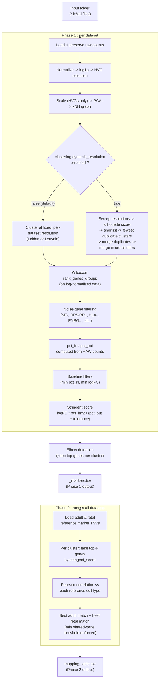

# Organoid Marker Extraction & Reference Mapping Pipeline

A scanpy/h5ad pipeline that clusters organoid single-cell datasets, extracts
curated marker genes per cluster, and maps each cluster onto adult and fetal
reference cell types via Pearson correlation.

The statistical logic includes Leiden/Louvain clustering, Wilcoxon marker tests, counts-based pct_in/pct_out, a stringent scoring formula, and elbow-based marker curation. Clustering resolution can be set per dataset (default) or found automatically via an opt-in silhouette + marker-coherence search.

---

## What it does

The pipeline runs in two independent phases, controlled entirely by one
`config.yaml` : no parameters are hardcoded in the script.

| Phase | Name | Input | Output |
|-------|------|-------|--------|
| **1** | Marker extraction | Folder of `.h5ad` files | One curated marker TSV per dataset |
| **2** | Reference mapping | Phase 1 outputs + adult/fetal reference TSVs | A single `mapping_table.tsv` |

You can run phase 1, phase 2, or both in one call.

---

## Pipeline workflow



---

## Phase 1 : Marker extraction (per dataset)

Runs independently for every `.h5ad` file discovered in `io.input_dir`
(subfolders are ignored). Steps:

1. **Load** : reads the `.h5ad` file, makes obs/var names unique, and ensures
   a `counts` layer holding raw (unnormalized) counts exists (created from
   `adata.X` if not already present). A raw snapshot is kept as `adata.raw`.
2. **Preprocess** : `normalize_total` → `log1p` → highly variable gene (HVG)
   selection → scaling (HVGs only, clipped) → PCA → kNN neighbor graph. All
   parameters (target sum, number of HVGs, PCs, neighbors, clip value, random
   seed) come from `preprocessing:` in the config.
3. **Cluster** : Leiden (default) or Louvain. Two modes, chosen via
   `clustering.dynamic_resolution.enabled`:
   - **Fixed resolution (default, off)** : resolution is **looked up per
     dataset** from `clustering.resolutions` in the config. If a discovered
     file has no matching entry, the pipeline logs a warning and **skips
     clustering for that file** rather than guessing.
   - **Dynamic resolution search (opt-in)** : the pipeline searches for a
     resolution itself instead of reading `resolutions`. See
     [Dynamic resolution clustering](#dynamic-resolution-clustering-optional)
     below.
4. **Differential expression** : `scanpy.tl.rank_genes_groups` (Wilcoxon test)
   on log-normalized expression, restricted to genes that survive noise-gene
   filtering (mitochondrial/ribosomal/housekeeping prefixes and an exact-match
   list, both configurable, plus optional `ENSG*` exclusion). Only
   positive-logFC hits are kept (mirrors Seurat's `only.pos = TRUE`).
5. **Detection percentages** : `pct_in` (fraction of in-cluster cells
   expressing the gene) and `pct_out` (same, for cells outside the cluster)
   are computed from the **raw counts layer**, not the log-normalized matrix :
   this mirrors the original `slot = "counts"` behavior in Seurat's
   `FindAllMarkers`.
6. **Baseline filtering** : keep genes with `pct_in >= min_pct_in` and
   `logFC >= min_logfc`.
7. **Stringent score**:

   ```
   stringent_score = logFC * (pct_in ** 2) / (pct_out + tolerance)
   ```

| Term | Meaning |
|---|---|
| `logFC` | Log fold-change of expression in the target group vs. all other groups : captures effect *magnitude*. |
| `pct_in` | Fraction of cells within the target cell type expressing the gene : captures within-group *penetrance*. Squaring this term disproportionately rewards genes that are broadly expressed across the target population, rather than only in a subset of cells. |
| `pct_out` | Fraction of cells in *all other* cell types expressing the gene : captures background/off-target expression (specificity). |
| `tolerance` | A stabilizing constant added to the denominator (see below). |

The result is a single score that jointly rewards genes that are strongly
up-regulated, expressed consistently throughout the target population, and
rarely expressed elsewhere : the combination of properties that makes a
gene a good discriminative marker, rather than optimizing for any one
property in isolation.

**Why `tolerance` is needed:** `pct_out` can legitimately be zero or very
close to zero for a highly specific marker. Dividing by `pct_out` directly
would make the score blow up (or divide by zero) for such genes, distorting
the ranking with noise rather than genuine specificity. Adding a small
constant `tolerance` to the denominator bounds the score and damps this
instability.

8. **Elbow detection** : genes are ranked by `stringent_score` within each
   cluster, and an elbow-point heuristic picks a natural cutoff among the top
   `max_n_shown` candidates, with a hard floor of `min_kept` genes per cluster.
9. **Export** : one TSV per dataset, `<dataset>_markers.tsv`, written to
   `<output_dir>/<markers_per_dataset_dir>/`.

A dataset that raises an exception at any step is logged and skipped; the
pipeline keeps processing the remaining datasets in the folder.

### Dynamic resolution clustering (optional)

Off by default (`clustering.dynamic_resolution.enabled: false`). Turn it on
when you don't already know a good resolution for a dataset and want the
pipeline to find one:

1. **Sweep** : cluster the dataset once per resolution from
   `resolution_min` to `resolution_max` (step `resolution_step`).
2. **Score** : compute the mean silhouette width for each resolution's
   clustering, on a subsample of up to `silhouette_max_cells` cells.
3. **Shortlist** : keep the `top_k_by_silhouette` resolutions with the best
   silhouette scores.
4. **Marker-coherence check** : for each shortlisted resolution, run a quick,
   loosely-thresholded marker test (`merge_min_logfc`, `merge_min_pct`) and
   flag pairs of clusters whose top `merge_top_n` genes overlap by at least
   `merge_overlap` : a sign they're really one population split in two.
   Pick the resolution with the fewest such duplicate pairs.
5. **Merge duplicates** : iteratively fold together clusters still flagged
   as duplicates (up to `merge_max_iterations` passes).
6. **Merge micro-clusters** : any cluster smaller than `min_cluster_frac` of
   all cells gets absorbed into its dominant neighbor in the kNN graph.

**NB:** this is noticeably slower than fixed-resolution clustering : it
clusters the dataset once per candidate resolution, plus a Wilcoxon pass per
merge iteration. It applies to **all** datasets in the input folder when
enabled (the fixed `clustering.resolutions` map is ignored in that case).
Requires `scikit-learn` (for the silhouette score) in addition to the other
dependencies.

### Phase 1 output columns (`<dataset>_markers.tsv`)

| Column | Meaning |
|---|---|
| `dataset` | dataset name (filename without `.h5ad`) |
| `gene` | gene symbol |
| `cluster` | cluster ID (string) |
| `logFC` | log fold-change from Wilcoxon test |
| `pval`, `pval_adj` | raw and BH-adjusted p-values |
| `scores` | Wilcoxon test statistic |
| `pct_in`, `pct_out` | detection fraction in/out of cluster (from raw counts) |
| `stringent_score` | composite specificity score |
| `rank` | 1-based rank within cluster after elbow curation |

---

## Phase 2 : Adult/fetal reference mapping

Runs once, across all Phase 1 outputs. Steps:

1. **Load references** : two single-file TSVs (adult and fetal), each with
   one row per `(cell_type, gene, score)`. Column names are configurable via
   `phase2.reference_columns`.
2. **Load organoid markers** : reads every `<dataset>_markers.tsv` produced
   in Phase 1 and groups rows by `(dataset, cluster)`.
3. **Top-N selection** : for each organoid cluster, take the top
   `phase2.top_n_genes` genes by `stringent_score`.
4. **Pearson correlation** : correlate the organoid cluster's gene scores
   against every reference cell type's gene scores, restricted to genes they
   have in common. A cell type is only considered a candidate match if the
   number of shared genes is at least `phase2.min_overlap_genes` (too few
   shared points makes Pearson's r unreliable).
5. **Best match selection** : for each cluster, keep the single best-scoring
   adult match and the single best-scoring fetal match (sorted by
   `r`, then by overlap size).
6. **Trinity overlap** : genes that appear in the organoid cluster's top list
   **and** in both the winning adult match **and** the winning fetal match.
7. **Export** : a single `mapping_table.tsv` written to
   `<output_dir>/<mapping_dir>/`.

### Phase 2 output columns (`mapping_table.tsv`)

| Column | Meaning |
|---|---|
| `Organoid_dataset` | dataset name |
| `Cluster` | organoid cluster ID |
| `Top_Marker_Genes` | top-N organoid marker genes, ranked order |
| `Adult_Match` / `Fetal_Match` | best-matching reference cell type (or empty if no match cleared the overlap threshold) |
| `Adult_Score` / `Fetal_Score` | Pearson r for the best match |
| `Adult_Overlap_Genes` / `Fetal_Overlap_Genes` | shared genes behind that correlation |
| `Trinity_Overlap_Genes` | genes shared across organoid, adult match, and fetal match simultaneously |

---

## Requirements

- Python 3.10+
- `scanpy`, `pandas`, `numpy`, `pyyaml`
- `scikit-learn` : only needed if `clustering.dynamic_resolution.enabled` is
  turned on (used for silhouette scoring)
- Input `.h5ad` files where `adata.X` holds raw (unnormalized) counts :
  the standard convention for QC'd single-cell exports

```bash
pip install scanpy pandas numpy pyyaml scikit-learn
```

---

## Expected inputs

1. **A folder of `.h5ad` files** (`io.input_dir`) : one file per organoid
   dataset, raw counts in `adata.X` (or an existing `counts` layer).
2. **A resolution entry per dataset** in `clustering.resolutions` in
   `config.yaml` : the key must exactly match the `.h5ad` filename (without
   extension). Datasets without a matching entry are skipped with a warning.
   **Not required** if `clustering.dynamic_resolution.enabled: true` : in
   that mode resolutions are searched automatically instead.
3. **(Phase 2 only)** Two reference marker TSVs : adult and fetal : each with
   one row per `(cell_type, gene, score)`, paths set in `phase2`.

## Deliverables

```
<output_dir>/
├── markers_by_dataset/
│   ├── <dataset_1>_markers.tsv
│   ├── <dataset_2>_markers.tsv
│   └── ...
└── mapping/
    └── mapping_table.tsv
```

- `markers_by_dataset/*_markers.tsv` : curated, ranked marker genes per
  cluster per dataset (Phase 1).
- `mapping/mapping_table.tsv` : one row per organoid cluster, with its best
  adult and fetal reference matches (Phase 2).

---

## Configuration

All behavior is controlled by `config.yaml`. Nothing needs to be edited in
`organoid_mapping.py` itself. Key sections:

- **`io`** : input folder, output folder, and output subfolder names.
- **`preprocessing`** : normalization target sum, HVG count, PCA components,
  neighbor count, scaling clip value, random seed.
- **`clustering`** : algorithm (`leiden`/`louvain`), cluster column name,
  Leiden flavor/iterations, and the **per-dataset resolution map**
  (`resolutions`).
- **`clustering.dynamic_resolution`** : off by default. When enabled, the
  resolution sweep range and step, the silhouette subsample size, the
  shortlist size, and all the duplicate/micro-cluster merge thresholds
  (`merge_top_n`, `merge_overlap`, `merge_min_logfc`, `merge_min_pct`,
  `merge_max_iterations`, `min_cluster_frac`).
- **`noise_genes`** : prefixes, exact gene names, and an `ENSG*` toggle used
  to strip housekeeping/mitochondrial/ribosomal genes before DE testing.
- **`marker_extraction`** : DE method (`wilcoxon`), positive-only toggle,
  p-value correction method, and which layer holds raw counts.
- **`marker_filtering`** : baseline thresholds (`min_pct_in`, `min_logfc`),
  minimum genes to always keep (`min_kept`), stringent-score `tolerance`, and
  the candidate pool size before elbow detection (`max_n_shown`).
- **`phase2`** : reference TSV paths, their column names, the mapping output
  subfolder, how many top genes to correlate per cluster (`top_n_genes`), and
  the minimum shared-gene threshold (`min_overlap_genes`).

Edit paths and tunables directly in `organoid_mapping_config.yaml`; there is
no need to touch the script.

---

## Usage

```bash
# Run both phases (default)
python organoid_mapping.py --config organoid_mapping_config.yaml

# Run only marker extraction
python organoid_mapping.py --config organoid_mapping_config.yaml --phase 1

# Run only reference mapping (requires Phase 1 output to already exist)
python organoid_mapping.py --config organoid_mapping_config.yaml --phase 2
```

`--config` is required and points to your YAML file. `--phase` defaults to
`both`.

---

## Notes & design decisions

- **Resolution is fixed by default, searchable on request.** Out of the box,
  clustering resolution per dataset is a deliberate, pre-chosen value in the
  config : reproducible, and matching the original Seurat notebook's
  behavior. Turning on `clustering.dynamic_resolution` trades that
  reproducibility and speed for a silhouette + marker-coherence search when
  you don't yet have a resolution picked for a dataset.
- **Percentages come from raw counts.** `pct_in`/`pct_out` are always
  computed from the `counts` layer, even though the Wilcoxon test itself runs
  on log-normalized data : this intentionally mirrors Seurat's
  `slot = "counts"` convention for `FindAllMarkers`.
- **Resilience.** Phase 1 processes each dataset independently; a failure on
  one dataset is logged and the pipeline continues with the rest of the
  folder rather than aborting the whole run.
- **Phase 2 needs Phase 1 outputs on disk.** It reads
  `<output_dir>/markers_by_dataset/*_markers.tsv`, so Phase 1 must have been
  run at least once (not necessarily in the same invocation).
